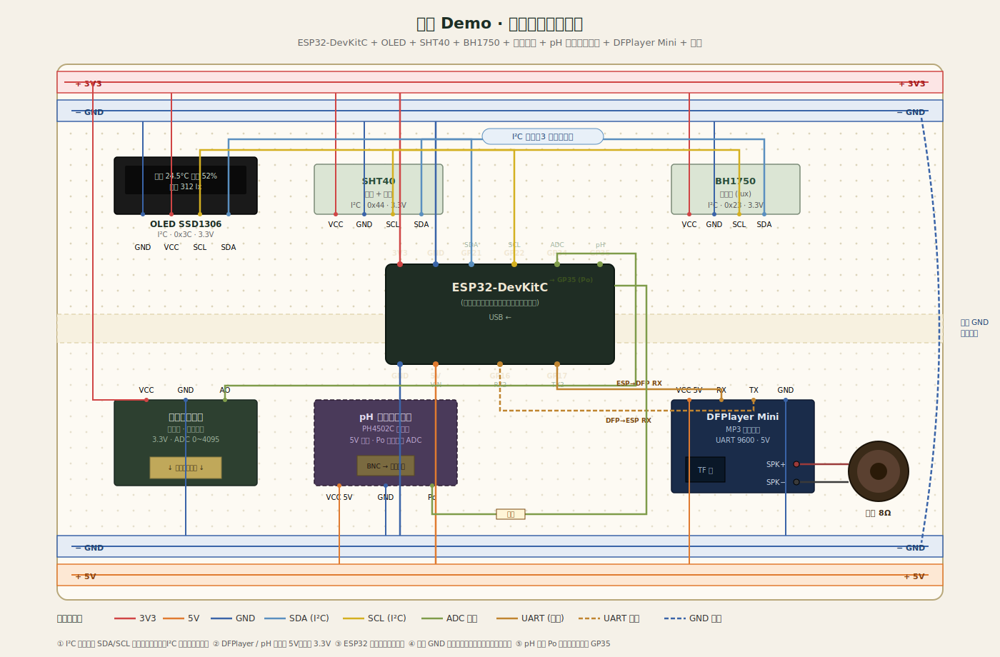
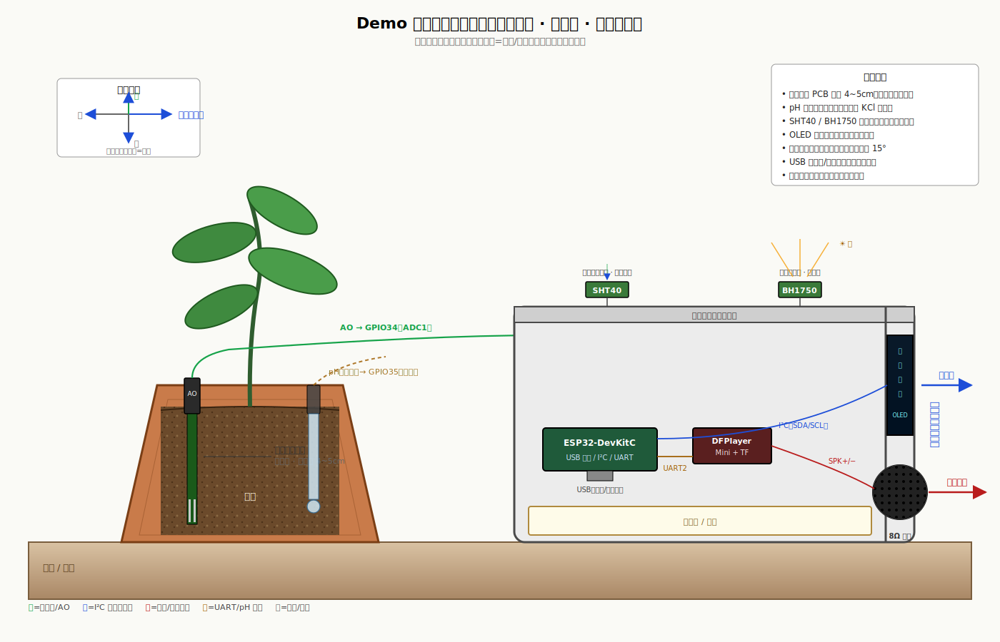
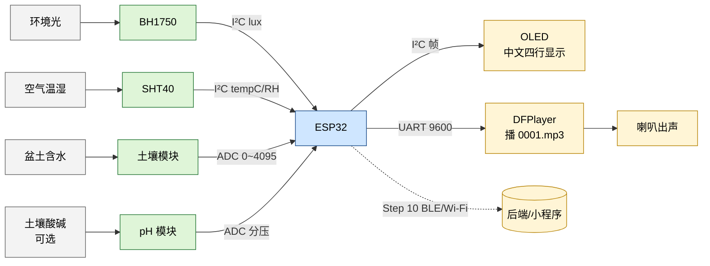

# 快速硬件 Demo（模块化 · 先走通信号）

目标：**几天到两周内**，用开发板 + 传感器模块 + 显示屏，在面包板上把 **温度、湿度、光照、盆土湿度** 读出来并显示（中文），并加上 **声音播报**；**不要求**与 `hardware-demo-pot-display-cn-probes` 一体机外观一致。
**土壤 pH**：真 pH 电极 + 模拟前端调试周期长，快速 Demo 建议 **首版用「模拟电压占位」或廉价 pH 模块仅做趋势演示**，下文会分「快版 / 较真版」两岔路。

---

## 你最终会得到什么

- 一块 **ESP32**（或兼容板）通过 **I²C / ADC** 读传感器。
- 一块 **0.96" OLED（SSD1306，I²C）** 上循环显示中文：温度、湿度、光照、盆土、（可选）pH。
- **声音播报**：见 **Step 6b**（任选 MP3 模块或中文 TTS 串口模块）。
- **USB 供电**，串口监视器可看到同一组数（调试用）。
- 可选：**手机 nRF Connect / 小程序后续再接 BLE**（第二步再做，先串口走通）。

---

## Step 1：采购清单（尽量一次买齐）

> 以下型号为「常见、文档多」的代表；你可买同功能兼容模块，**接线前务必核对模块丝印与卖家原理图**。

| 序号 | 物品 | 作用 | 备注 |
|------|------|------|------|
| 1 | **ESP32-DevKitC** 或 **ESP32-S3-DevKitC-1** | 主控 + USB + Wi-Fi/BLE | 新手 DevKitC 资料最多 |
| 2 | **面包板 + 杜邦线（母-母、公-母）** | 搭线 | 线尽量短，减少干扰 |
| 3 | **0.96" OLED SSD1306 I²C（4 针：GND VCC SCL SDA）** | 中文显示 | 3.3V 版本；有的 VCC 写 3v3 |
| 4 | **SHT40 或 SHT30/SHT31 模块（I²C）** | 空气温湿度 | 比 DHT22 稳 |
| 5 | **BH1750 模块（I²C）** | 光照（lux） | 便宜够用 |
| 6 | **电容式土壤湿度模块（模拟输出）** | 盆土含水趋势 | 输出 0～3.3V 量级，**非校准含水量%** |
| 7 | **USB 线（数据线）** | 供电 + 烧录 | 必须是数据线 |
| 8 | （可选）**pH 检测模块（带 BNC 电极）** | 快 Demo「有个 pH 数」 | 电极需浸泡校准，见 Step 7 岔路 |
| 9 | **声音播报（二选一或先做 A）** | 见 Step 6b | 下表展开 |

#### 声音播报子清单（Step 6b 用）

| 方案 | 典型模块 | 优点 | 缺点 |
|------|-----------|------|------|
| **A：MP3 文件播放** | **DFPlayer Mini** + **TF 卡** + **8Ω 喇叭（0.5～3W）** | 资料多、离线、无网络 | 任意数字要拼句需 **多段预录** 或只播固定话术 |
| **B：中文 TTS（串口）** | **SYN6288 / XFS5152** 等（以卖家协议为准） | 可把「当前温度二十五点三摄氏度」**拼字符串播出** | 成本略高；需核对 **3.3V/5V 电平** 与 **GB2312/UTF-8** 帧格式 |
| **C（不推荐首版）** | **I²S 功放（如 MAX98357）+ 网络 TTS** | 内容灵活 | 要 Wi‑Fi、鉴权、缓冲，**远超快速 Demo** |

**首版建议**：要「像产品」读数 → 优先 **方案 B**；只要「有声音、路演气氛」→ **方案 A** 预录 5～10 条 MP3（如「请浇水」「环境干燥」）+ 简单 `beep` 占位。

**不买的（首版快速 Demo 可省）**：锂电池、充电管理、金属触脚结构件——等信号走通再上。

---

## Step 2：固定引脚约定（ESP32 示例）

以下用 **Arduino 框架** 常见默认（可按你板子调整）：

| 信号 | ESP32 连接 |
|------|------------|
| OLED SDA | GPIO21 |
| OLED SCL | GPIO22 |
| SHT40 SDA / SCL | **与 OLED 共 I²C 总线**（同 SDA/SCL） |
| BH1750 SDA / SCL | **同上共总线**（地址不同，见代码） |
| 土壤模块 AO | **ADC1**：如 GPIO34（仅输入脚） |
| **（可选）pH 模块 Po** | **ADC1**：如 GPIO35（仅输入脚）；模块若 5V 输出**必须经分压**到 ≤3.3V |
| pH 模块 VCC | **5V**（PH4502C 等常见型号）；少数 3.3V 版本可直接接 3V3 |
| **DFPlayer UART RX**（接 ESP 的 TX） | **GPIO17**（UART2 TX，示例） |
| **DFPlayer UART TX**（接 ESP 的 RX） | **GPIO16**（UART2 RX，示例） |
| DFPlayer VCC | **5V**（多数模块要求 4.2～5.2V；与 ESP 同供电时注意 USB 口电流是否够） |
| DFPlayer SPK+ / SPK− | **小喇叭** 两根线 |
| 共地 GND | 所有模块 GND 相连 |
| 3.3V | OLED、SHT、BH1750 接 3V3（**土壤模块看卖家：有的标 3.3～5V，勿接 5V 到只支持 3.3 的脚**） |

**要点**：
- I²C **上拉**：很多模块板载 4.7k，若总线不稳定再补一个上拉到 3.3V。
- **土壤模拟线**远离 I²C 时钟线，线短一些。
- **UART2 与 USB**：烧录/打印若也用 UART0，勿与 GPIO1/3 冲突；DFPlayer 用 `Serial2` 较常见。若 **ESP32-S3** 默认 USB CDC 占用，请按板子说明换 **UART1** 引脚。
- **方案 B（TTS）**：若模块为 **5V TTL**，ESP32 的 RX 侧建议加 **电平转换**（分压仅应急，量产勿省专用芯片）。

---

## 接线参考图

### 俯视布线图（面包板）



> 面包板 + ESP32 + OLED / SHT40 / BH1750 / 土壤 / pH（可选） / DFPlayer / 喇叭 的彩色俯视，含所有跳线走向与轨道分布。

### 侧视摆放图（探针入土 · 屏朝前 · 喇叭朝外）



> 剖面示意：土壤探针 PCB 入土 4~5cm、pH 玻璃球泡入土、SHT40 / BH1750 朝上裸露、OLED 朝前、喇叭朝外。

> 下面两张图给出**面包板物理布局**（ASCII 俯视）和**信号流**（Mermaid），作为上面两张 SVG 的文本/逻辑视图补充。

### 图 1：面包板物理布局（俯视 ASCII）

```
                                                  ESP32-DevKitC（横跨中线插入）
┌──────────────────────────────────────────────────────────────────────────────┐
│ 3V3轨 ●━━━━━━━━━━━━━━━━━━━━━━━━━━━━━━━━━━━━━━━━━━━━━━━━━━━━━━━━━━━━━━━━━━━━ │←接ESP32 3V3
│ GND轨 ●━━━━━━━━━━━━━━━━━━━━━━━━━━━━━━━━━━━━━━━━━━━━━━━━━━━━━━━━━━━━━━━━━━━━ │←接ESP32 GND
│                                                                              │
│        ┌─────────────┐                                                       │
│        │             │a                                                      │
│        │             │b   ┌──OLED──┐ ┌─SHT40─┐ ┌─BH1750─┐                    │
│        │             │c   │GND VCC │ │GND VCC│ │GND VCC │                    │
│        │   ESP32     │d   │SCL SDA │ │SCL SDA│ │SCL SDA │                    │
│        │             │e   └──┬──┬──┘ └──┬─┬──┘ └──┬─┬──┘                     │
│ ━━━━━━━│ (跨中线)    │━━━━━━━│━━│━━━━━━━│━│━━━━━━━│━│━━━━ 中线 ━━━━━━━━━━━━━│
│        │             │f      │  └───────┴─┴───────┘ │   ← SDA 全部并到 GPIO21 列
│        │             │g      └──────────┴───────────┘   ← SCL 全部并到 GPIO22 列
│        │             │h                                                      │
│        │             │i   ┌─土壤模块─┐ ┌pH模块(可选)┐ ┌─DFPlayer Mini─┐    │
│        │             │j   │VCC GND AO│ │VCC GND  Po │ │ VCC GND RX TX │ SPK│
│        └─────────────┘    └─┬───┬──┬─┘ └─┬───┬───┬──┘ └──┬───┬──┬──┬─┘ →喇叭│
│                             │   │  │     │   │   │       │   │  │  │        │
│                             │   │  └→GPIO34   │   └→GPIO35 (分压) │  └→GPIO16(RX2)│
│                             │   │            │  (5V)        │   │  └→GPIO17(TX2)│
│ GND轨 ●━━━━━━━━━━━━━━━━━━━━━━━━━━━━━━━━━━━━━━━━━━━━━━━━━━━━━━━━━━━━━━━━━━━━ │←跨接到上面GND轨
│ 5V轨  ●━━━━━━━━━━━━━━━━━━━━━━━━━━━━━━━━━━━━━━━━━━━━━━━━━━━━━━━━━━━━━━━━━━━━ │←接ESP32 5V (DFPlayer用)
└──────────────────────────────────────────────────────────────────────────────┘

颜色说明：
  ━━ 红轨 = 3V3 / 5V 电源汇总
  ━━ 蓝轨 = GND 汇总（上下两条用一根短线桥接！）
  │ 纵向 a-e 列 = ESP32 上半引脚所在列，可以再插跳线引出去
  │ 纵向 f-j 列 = ESP32 下半引脚所在列
  ↘  虚拟连线 = 跳线，把模块对应针脚拉到正确的轨/列
```

**推荐插法（从上到下）**：

1. **顶部 3V3 红轨 + GND 蓝轨**：先把 ESP32 的 3V3 / GND 各拉一根到这两条轨。
2. **ESP32 跨中线插下**：左半（a-e）和右半（f-j）正好分到中线两侧 —— **必须跨**，否则左右两排针会被簧片短接烧板。
3. **I²C 三件套（OLED / SHT40 / BH1750）并排插在中线另一侧**：
   - 每个模块的 VCC 拉短线到顶部红轨；
   - GND 拉到顶部蓝轨；
   - SDA 全部插到 **ESP32 GPIO21 所在的那一列**；
   - SCL 全部插到 **ESP32 GPIO22 所在的那一列**。
4. **土壤模块**：VCC→3V3 红轨、GND→蓝轨、AO→ESP32 GPIO34 所在列。
5. **DFPlayer**：VCC→**下方 5V 红轨**、GND→下方蓝轨、RX/TX 交叉到 GPIO17/16 所在列，喇叭两根线直接拧上模块的 SPK+/SPK−。
6. **（可选）pH 模块**：VCC→**下方 5V 红轨**（PH4502C 等 5V 模块），GND→下方蓝轨，**Po 输出务必经分压**（如 10k+20k 二电阻分压到 ≤3.3V）再接 GPIO35。校准与岔路见 Step 7。
7. **跨接两条 GND 蓝轨**：用一根短跳线把上下两条蓝轨连起来 —— 这一步漏了，下半模块就没共地。

### 图 2：信号流（环境量 → ESP32 → 屏 / 音 / 云）



读图要点：
- **绿色** = 传感器；**蓝色** = MCU；**黄色** = 输出（屏/音/云）；**灰色** = 物理环境量。
- 实线箭头 = 当前 Demo 已通；虚线 = Step 10 之后再接到 BLE/Wi-Fi 回传后端。

---

## Step 3：安装开发环境（一次性）

1. 安装 **Arduino IDE 2.x**（或 PlatformIO + VS Code，二选一即可）。
2. 在 Arduino IDE：**文件 → 首选项 → 附加开发板管理器网址** 加入 ESP32 的 JSON（使用 Espressif 官方文档当前地址）。
3. **工具 → 开发板 → 开发板管理器**，搜索 **esp32**，安装 **esp32 by Espressif Systems**。
4. 选择你的板型：**ESP32 Dev Module**（或对应 S3 板）。
5. 选择正确的 **COM 端口**（设备管理器里看 USB-SERIAL）。

---

## Step 4：安装库

在 Arduino IDE：**工具 → 管理库**，安装：

- **Adafruit GFX Library**
- **Adafruit SSD1306**（或 **U8g2**，若你要更好中文显示推荐 **U8g2**，见 Step 5 说明）
- **Adafruit SHT4x Library**（若用 SHT40）或 **Sensirion I2C SHT** 系列对应库
- **BH1750**（作者 Christopher Laws 或常用 BH1750 库）
- **DFPlayerMini**（作者 **Makuna**；Arduino 库管理器搜 *DFPlayer*）— **仅方案 A（DFPlayer）** 需要

土壤湿度：**无需库**，`analogRead()` 即可。
**中文 TTS 模块**：多数用 **厂家 PDF 里的串口帧** 自行 `Serial2.write()` 即可，不一定有现成 Arduino 库。

---

## Step 5：第一版固件——只做「读数 + 串口打印」（先不刷屏）

**目的**：确认 I²C 地址无冲突、ADC 有变化。

1. 新建草图，只初始化 **Wire（I²C）**，依次 `begin()` SHT、BH1750。
2. `loop` 里每 1 秒：读温湿度、读光照、读 `analogRead( soilPin )`。
3. **串口监视器 115200** 打印一行 CSV。

**验收**：手遮挡传感器、对土壤模块吹气/插湿土，数值应有可见变化。

---

## Step 6：第二版固件——OLED 中文四行

1. 换用 **U8g2** + `u8g2_font_wqy12_t_gb2312b`（或 `wqy14`）以支持中文（字库较大，编译略慢）。
2. 屏幕布局示例：
   - `温度 24.5℃`
   - `湿度 52%`
   - `光照 312 lx`
   - `盆土 058`（用 ADC 原始 0～4095 或映射 0～99，**注明非真实含水率**）

**验收**：上电 3 秒内屏亮；中文无乱码；数值与串口一致。

---

## Step 6b：声音播报模块（OLED 正常后再接）

> 原则：**先不接喇叭**，只接串口，用串口监视器确认 UART 无乱码；再插 TF（方案 A）或发 TTS 帧（方案 B），最后接喇叭 **音量从小开始** 防啸叫。

### 方案 A：DFPlayer Mini + TF 卡

1. **TF 卡**：FAT32；根目录放 `0001.mp3`、`0002.mp3` …（DFPlayer 常用 **0001～0255** 命名规则，以你买的库说明为准）。
2. **接线**：见 Step 2 表；**RX / TX 交叉**：ESP `TX2` → DFPlayer `RX`，ESP `RX2` → DFPlayer `TX`。
3. **供电**：DFPlayer 用 **5V**；与 ESP 共地。若 USB 供电不稳（播放卡顿），可临时 **独立 5V 电源模块** 只给 DFPlayer+喇叭（地与 ESP 仍相连）。
4. **代码**：`Serial2.begin(9600, SERIAL_8N1, RXD, TXD);`，库中 `myDFPlayer.begin(Serial2);`，先 `play(1)` 测能否出声。
5. **与传感器联动（Demo 逻辑示例）**：
   - 盆土 ADC 高于阈值 → `play(3)` 播放你预录的「请浇水」；
   - 或每 60 秒播一次 `0002.mp3` 固定提示。
6. **验收**：上电自动播测试音；串口无报错；喇叭无持续底噪（有底噪检查地与线长）。

### 方案 B：中文 TTS 串口模块（推荐「读数字」）

1. 按卖家手册接 **VCC/GND/TX/RX**；确认 **波特率**（常见 9600）与 **电平**（3.3V 与 5V TTL 混用需 **电平转换模块**）。
2. 用 **十六进制或 GB2312 文本帧** 发送一句话，例如拼接：`"当前温度"` + 数字转中文 + `"摄氏度"`（具体帧格式 **以模块手册为准**，不同厂不兼容）。
3. 在 `loop` 里：**读传感器 → 组串 → 发 TTS → `delay`**，避免在 TTS 播放未完成时连续塞指令（手册一般有「忙」引脚或固定间隔）。
4. **验收**：串口回显（若有）正常；播报与屏显同一组数。

### 排障

| 现象 | 可能原因 |
|------|-----------|
| DFPlayer 无声 | TF 命名/格式错；RXTX 反接；音量 `setVolume` 太低 |
| 电流声、啸叫 | 地与电源阻抗大；喇叭线过长；先降音量 |
| TTS 乱码 | 波特率错；未按帧头帧尾；编码不是模块要求的 GB2312 |

---

## Step 7：土壤 pH —— 快速 Demo 两岔路

### 岔路 A（推荐「最快」）：屏上不标「实验室 pH」

- **不做 pH 电极**，第四行改为 **「pH --」** 或 **「pH 见 App」**。
- 对外话术：**「首版 Demo 聚焦温湿度光与盆土趋势；pH 为量产前专项」**。

### 岔路 B（「有个数」）：买现成 pH 模块 + 电极

1. 模块常见输出：**模拟电压** 或 **串口已算好的 pH**。优先选 **文档里有「校准旋钮 / 校准命令」** 的。
2. 若模拟输出：接 ESP32 ADC（注意 **输入电压 ≤ 3.3V**；模块若输出 0～5V **必须分压**，否则会烧 ADC）。
3. **校准**：按卖家说明用 **pH4 / pH7 缓冲液** 做两点；缓冲液需另购。
4. 屏上写：**「pH 6.2（趋势）」**，避免承诺精度。

**验收**：泡入 pH7 缓冲液稳定后，读数应能拉到 7 附近（允许 ±0.3～0.5 视模块质量）。

---

## Step 8：稳定性小检查（半天）

- **连续跑 2 小时**：是否随机死机、I²C 卡死（可加 `Wire.setClock(100000)` 先降速）。
- **上电顺序**：有的 OLED 需延时 100ms 再 init。
- **看门狗**（可选）：`esp_task_wdt_init` 防止阻塞。

---

## Step 9：从面包板到「像产品」的 1 小时摆拍（可选）

- 用硬纸板剪一个 **圆角矩形框** 粘在花盆边，把 OLED 嵌前面，模块藏后面，线走背面——**路演够用**，仍不算结构开模。

---

## Step 10：再接到软件（第二阶段，非「走通硬件」必须）

1. 在 ESP32 上开 **BLE GATT**，把温湿度光照盆土打包成 Notify。
2. 小程序用 **蓝牙适配器 API**（需类目与权限）或先做 **独立调试 App** 收 BLE。
3. 后端增加 **设备数据上报** 路由与存储——与当前 `greenAI` 后端可另开仓库/分支，避免污染 MVP。

---

## 常见问题（FAQ）

**Q：I²C 扫不到地址？**
检查 SDA/SCL 是否反接、是否共地、模块是否上电、部分 OLED 的 `0x3C`/`0x3D` 需在代码里试。

**Q：土壤湿度不变？**
换 ADC 脚（避开仅输出脚）、确认土壤模块输出是模拟不是数字阈值-only 款。

**Q：播报时屏闪或 I²C 偶发失败？**
先拉长 TTS 指令间隔；`Wire` 与 `Serial2` 不要在中断里操作；播放高峰瞬间电流大，检查 USB 供电与飞线长度。

---

## 与《BUILD-GUIDE》的关系

- **[BUILD-GUIDE-pot-display-cn-probes.md](./BUILD-GUIDE-pot-display-cn-probes.md)**：走向 **量产、结构、认证** 的完整路线。
- **本文**：**最快把电信号与显示跑通** 的模块化路线；量产前再合并成一体机。

---

若你希望仓库里再带 **一份可直接编译的 Arduino 示例草图**（单 `.ino` + `platformio.ini`），可以说一下你手头的板子是 **ESP32 还是 ESP32-S3**，我可以按该板写最小可运行版本（仍放在 `docs/reference/hardware-demo/` 下子目录，不污染主工程编译）。
