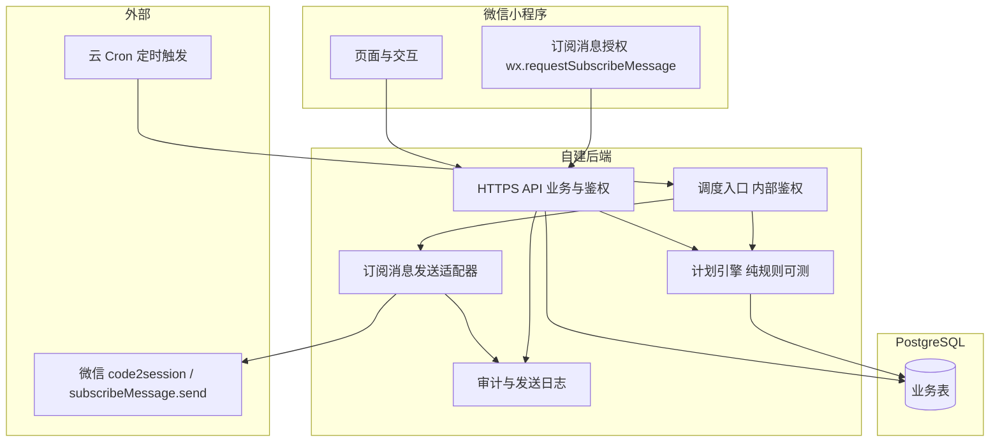

# 工程设计：植物管家 MVP A（小程序 + 订阅消息 + 自建后端）

> 状态：草案已定稿待你确认  
> 日期：2026-05-18  
> 依据：`doc/项目计划书 - 详细.md` 中 v1.0 方向；实施范围收敛为 **MVP A**。

---

## 1. 目标与成功标准

### 1.1 产品目标

验证：**「针对用户环境与单株植物的养护节奏 + 可触达提醒」** 是否能让用户持续执行（打开小程序完成任务、减少养死）。

### 1.2 MVP 范围（做）

- 微信小程序：注册/登录（微信）、添加植物（**手动录入**名称/品种或从简易列表选择）、环境简项、展示计划与今日任务。
- 用户操作：**标记浇水/施肥等完成**，用于校准后续计划。
- **提醒**：通过微信 **订阅消息** 下发「该浇水/该施肥」类通知（受微信额度与订阅规则约束）。
- **自建后端** + **PostgreSQL**；定时任务由云厂商 Cron（或等价调度）调用后端 **内部接口** 触发扫描与入队发送。

### 1.3 明确不做（本 MVP）

- 植物识别、土壤拍照、病害诊断、硬件、商城、社区、复杂内容运营后台（可保留最小只读排查能力即可）。

### 1.4 成功标准（可度量）

- 用户完成「添加植物 → 生成计划 → 至少一次订阅授权 → 收到至少一条订阅消息 → 在小程序内标记完成」漏斗可观测。
- 计划引擎对核心用例有自动化测试；发送链路有日志与失败原因统计。

---

## 2. 微信「推送」约束（架构前提）

小程序无通用静默推送。本设计中的「推送」= **订阅消息**：

- 用户需在小程序内对模板发起 **订阅授权**，服务端仅在 **有可用次数** 时调用发送接口。
- 额度用尽后需 **再次引导订阅**；产品需接受「无法保证 100% 触达」。
- 模板 ID、类目、文案需在微信公众平台配置并通过审核；具体字段以微信文档为准。

**兜底**：小程序内 **今日任务列表 + 红点/角标（若支持）**；未订阅或额度不足时不报错刷屏，而是静默降级为站内可见任务。

---

## 3. 总体架构

**原则**：计划引擎 **不依赖** 微信；发送适配器 **仅依赖** 微信接口与本地存储的订阅状态。

---

## 4. 认证与安全

### 4.1 小程序用户身份

- 小程序 `wx.login` 取得 `code` → 后端调用 `code2session` 换取 `openid`（及 `session_key`）。
- 后端签发 **会话令牌**（建议短期 JWT 或随机 session id + HttpOnly 策略的等价安全存储；小程序常用 **自定义登录态** 存 `storage` + 请求头携带 token，**须 HTTPS**）。
- 所有业务 API **校验用户身份**，仅操作当前 `openid`/`user_id` 对应数据。

### 4.2 调度入口保护

- Cron 调用的 `/internal/jobs/reminders`（示例路径）**禁止公网匿名**：固定 **HMAC 签名**、**mTLS** 或 **IP 允许列表 + 密钥** 任选其一；密钥仅存服务端与 Cron 配置。

### 4.3 密钥管理

- 微信 AppSecret、数据库连接串、Cron 密钥：**环境变量**注入；不入库、不进前端包。

---

## 5. 核心领域模型（逻辑）

以下用逻辑实体描述；物理表名可在实现阶段英文化。

| 实体 | 说明 |
|------|------|
| User | 与微信 `openid` 绑定；时区、可选默认城市等 |
| Plant | 用户植物；昵称、品种标识（手填或枚举 id）、摆放/光照/是否暖气等简项 |
| CarePlan | 某株植物的「当前生效计划」：基础间隔、任务类型集合、生效时间 |
| CareTask | 原子任务：类型（浇水/施肥…）、计划执行日、状态（待完成/已跳过/已完成）、幂等键 |
| SubscribeGrant | 订阅授权结果缓存：模板 id、与微信返回结构对齐的凭据/次数、更新时间 |
| NotificationLog | 发送请求与响应摘要：task_id、模板、结果码、重试次数 |

**幂等**：`CareTask` 全局唯一 id；同一 task 的订阅消息成功发送后写标志，调度器跳过重复发送。

---

## 6. 计划引擎（MVP 规则）

### 6.1 输入

- 植物品种或用户选择的「养护难度/喜水程度」枚举（MVP 可用简单问卷替代完整品种库）。
- 环境简项：室内/室外、是否暖气、摆放光照档位。
- 可选：**城市或经纬度** → 天气 API（与商业计划一致）；**MVP 第一期可关闭**，仅用手动环境档位，以降低外部依赖与成本。

### 6.2 输出

- 生成未来 **N 天**（如 14）的 `CareTask` 队列；用户标记完成后 **滚动补充** 后续任务。
- 浇水间隔 = 基础间隔 × 环境系数（具体系数表实现时落配置表或代码常量，**必须单测覆盖**）。

### 6.3 与商业计划书中「动态公式」的关系

- 商业书中的多因子公式作为 **v1.1** 增强；MVP 采用 **可解释的少量系数**，避免过度拟合与黑盒。

---

## 7. 提醒调度与发送

### 7.1 调度频率

- Cron **每 15 分钟或每小时**（实现时按成本选择）；扫描「当前时刻窗口内到期且状态为待完成」的任务。

### 7.2 发送流程

1. 选出候选 `CareTask`。
2. 查 `SubscribeGrant`：对应模板是否有可用次数；无则 **不发微信**，记 `skipped_no_quota`，任务仍在站内展示。
3. 调用微信 `subscribeMessage.send`（或当前官方等价 API）；成功则扣减本地记录并写 `NotificationLog`。
4. 失败重试：有限次数指数退避；**禁止无限重试**。

### 7.3 用户完成/跳过

- **完成**：更新任务状态，引擎根据新「上次浇水日」重算后续任务（可异步 job）。
- **跳过**：记录跳过原因；延长下次建议日或降低频率（MVP 可用简单规则：跳过则下次 +2 天）。

---

## 8. 小程序端关键页面（最小集）

1. **首页**：今日任务列表；未完成高亮。
2. **植物列表 / 详情**：添加、编辑、删除（软删可选）。
3. **任务完成**：一键完成浇水等。
4. **订阅引导**：在「保存计划成功」或「进入首页」等合规时机调用 `requestSubscribeMessage`；文案说明为何需要授权。

---

## 9. 后端 API 草案（对外）

路径与命名实现时可调整；此处定义职责边界。

| 方法 | 路径（示例） | 说明 |
|------|----------------|------|
| POST | `/auth/wechat` | code 换登录态 |
| GET/POST | `/plants` | 列表与创建 |
| PATCH/DELETE | `/plants/:id` | 更新与删除 |
| POST | `/plants/:id/plan/regenerate` | 根据最新环境与完成记录重算计划 |
| POST | `/tasks/:id/complete` | 完成任务 |
| POST | `/tasks/:id/skip` | 跳过 |
| POST | `/subscribe/report` | 上报订阅授权结果（与微信字段对齐） |

内部：

| 方法 | 路径（示例） | 说明 |
|------|----------------|------|
| POST | `/internal/jobs/reminders` | Cron 触发扫描与发送 |

---

## 10. 观测与运维

- 结构化日志：请求 id、user_id、plant_id、task_id。
- 指标建议：发送成功率、因无订阅跳过比例、计划生成耗时。
- 健康检查：`/health` 供负载均衡探测。

---

## 11. 测试策略

- **计划引擎**：纯函数单元测试（输入环境与历史完成记录 → 断言下一批任务日期）。
- **API**：契约测试或集成测试（含鉴权失败、越权访问他人植物应 403/404）。
- **发送适配器**：Mock 微信 HTTP 客户端，断言重试与幂等。

---

## 12. 技术选型建议（非强制）

- **后端语言**：Node（Nest/Fastify）或 Python（FastAPI）均可；团队熟悉度优先。
- **ORM**：Prisma / SQLAlchemy 等任选；迁移工具管理 schema。
- **部署**：容器 + 托管 Cron；数据库托管 PostgreSQL。

---

## 13. 分阶段交付（建议）

| 阶段 | 内容 |
|------|------|
| P0 | 用户登录、植物 CRUD、站内任务列表、计划引擎无天气 |
| P1 | Cron + 订阅消息发送闭环 + 日志与幂等 |
| P2 | 天气 API 接入与系数联动（可选） |

---

## 14. 自审记录（占位与一致性）

- [x] 无「TBD 技术栈必须」类空白；实现语言开放。
- [x] 「推送」与微信能力表述一致：订阅消息，非系统推送。
- [x] 范围与 MVP A 一致；识别/诊断未纳入。
- [x] 自建后端（乙）与 Cron 边界清晰。

---

## 15. 待你确认后进入的下一步

你确认本文无修改意见后，将使用 **writing-plans** 流程产出 **分文件/分任务的实现计划**（仓库脚手架、表结构、接口清单、小程序与后端并行顺序），再开始编码。
